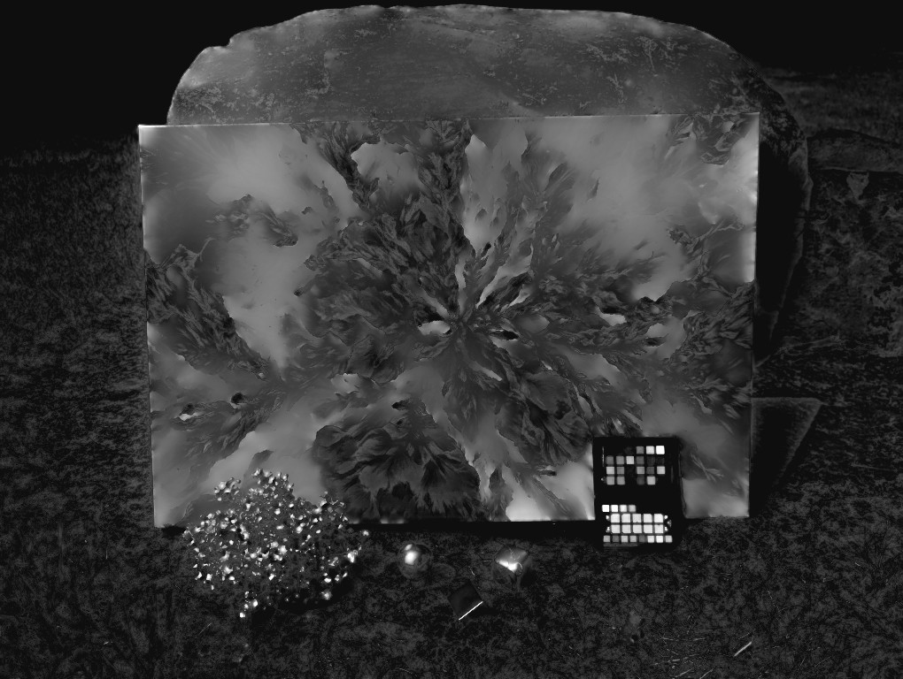
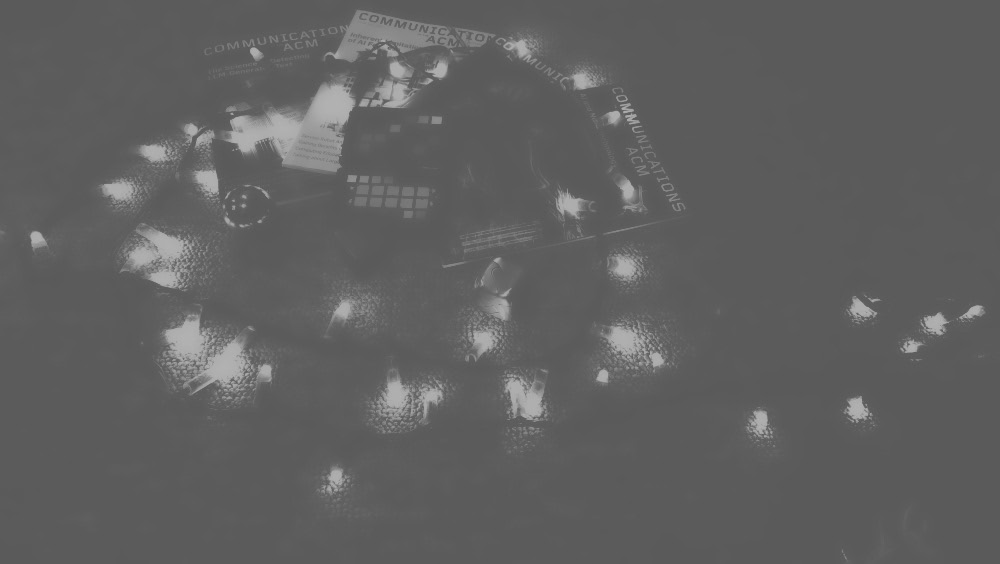

# UltraHDR Splitter

Split UltraHDR jpeg images into the base image, the gain map image, and the gain map data

Example images are of two scenes, and most are available in RAW, original Jpeg from device, and raw processed through Lightroom. Android Phone HDR have a single channel gain map, and Lightroom processed have three channel gain map. Each table entry is for scene 1/scene 2 file present.

| Camera      | Original Ultra HDR | Lightroom processed | RAW  |
| ----------- | ------------------ | ------------------- | ---- |
| Pixel 8 Pro | Y/Y                | Y/Y                 | Y/Y  |
| Galaxy S24  | Y/Y                | N/Y                 | N/Y  |
| Galaxy S22  | Y/Y                | N/Y                 | N/Y  |
| Pixel 6     | Y/Y                | Y/Y                 | Y/Y  |

For example, here is the original UltraHDR image from the Pixel 8 Pro, 

Here are the SDR and (single channel) gain map images from the phone after being split by this tool,  

and here are the Lightroom processed SDR and (three channel) gain map from the RAW version from the phone, split by this tool:

Here's the above picture and a second example to show the comparisons

|                                       |                                                       |                                                              |                                                              |
| ------------------------------------- | ----------------------------------------------------- | ------------------------------------------------------------ | ------------------------------------------------------------ |
| Pixel 8 Pro original                  |  |  |  |
| Pixel 8 Pro via RAW through Lightroom |                                                       |  |  |
| Galaxy S24 Original                   |  |  |  |
| Galaxy S24 via RAW through Lightroom  |                                                       |  |  |

s
